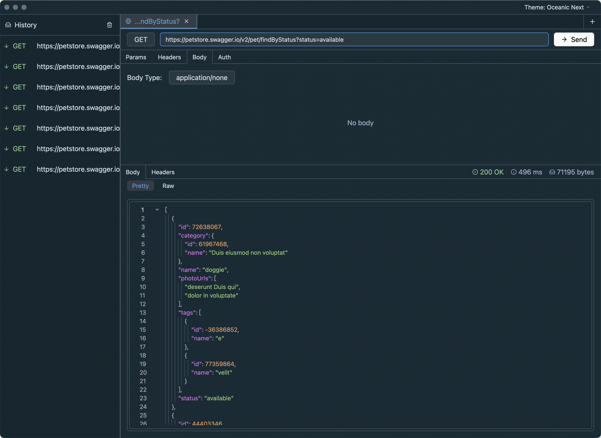
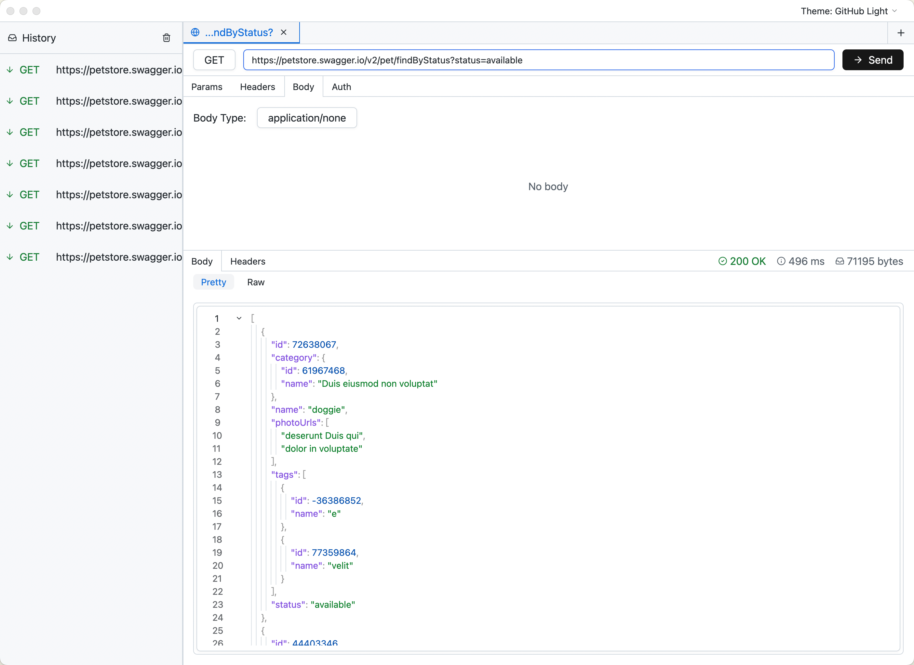

# HiPoster

[](https://github.com/wandercn/hiposter/releases)

HiPoster is a high-performance, modern API testing tool built with Rust and the GPUI framework. It offers a fast, fluid, and native desktop experience designed to streamline your daily HTTP request debugging.

<p align="center">
  
  
</p>

## Features

- **🚀 High Performance**: Built entirely in Rust and GPU-accelerated via Zed's GPUI framework.
- **💻 Cross-Platform**: Native builds available for macOS (Universal Binary for Intel & Apple Silicon), with scripts provided for Windows and Linux.
- **🎨 Beautiful Themes**: Comes with multiple built-in color schemes including GitHub Light, Solarized Light, One Light, Vitesse Light, and Catppuccin Latte.
- **🔄 Complete HTTP Support**: Full support for query parameters, custom headers, and multiple body types (`application/json`, `multipart/form-data`, `application/x-www-form-urlencoded`, `text/plain`, etc.).
- **🔒 Authentication**: Built-in support for Bearer Token and Basic Auth.
- **📚 History Tracking**: Automatically saves your request history for quick access and re-execution.
- **✨ Syntax Highlighting**: Auto-formats and syntax-highlights JSON requests and responses.

## Installation

You can build HiPoster from source.

### Prerequisites

- [Rust](https://rustup.rs/) (latest stable)
- On macOS, you will also need Xcode command-line tools.

### Building for macOS

To build a Universal Binary (supports both Intel and Apple Silicon Macs) packaged as a `.dmg`:

```bash
./scripts/build_macos.sh
```

The resulting `HiPoster.dmg` will be available in the `target/release/` directory.

### Building for Linux

A script is provided to compile and package the app for Linux (Debian/Ubuntu):

```bash
./scripts/build_linux.sh
```

### Building for Windows

Due to the GPUI framework's strict reliance on native Windows APIs, DirectX 12, and the MSVC toolchain, **cross-compiling for Windows from Linux or macOS is not supported.**

To build the application, you must use a native Windows environment (or a Windows VM/CI). 

1. Install [Build Tools for Visual Studio 2022](https://visualstudio.microsoft.com/visual-cpp-build-tools/).
2. Select the **"Desktop development with C++"** workload (ensure Windows 10/11 SDK is included).
3. Open **"Developer PowerShell for VS 2022"** (do not use regular PowerShell) and run:

```powershell
.\scripts\build_windows.ps1
```

## 📖 Development Guide

We have prepared a comprehensive development guide for developers interested in learning how to build high-performance desktop applications with **GPUI**.

The book covers:
- GPUI's Entity-View-Model architecture.
- High-performance rendering with the **Dirty Flag** pattern.
- Asynchronous task management and UI safety.
- Standardized cross-platform data persistence.

### How to view the book

The book is built using [mdBook](https://github.com/rust-lang/mdBook).

1. **Install mdBook**:
   ```bash
   cargo install mdbook
   ```

2. **Serve the book locally**:
   ```bash
   mdbook serve book --open
   ```

3. **Build the static HTML**:
   ```bash
   mdbook build book
   ```
   The output will be in `book/book/`.

## About

- **Version**: 0.1.0
- **Author**: wander
- **Source Code**: [https://github.com/wandercn/hiposter](https://github.com/wandercn/hiposter)

## License

This project is licensed under the MIT License.
